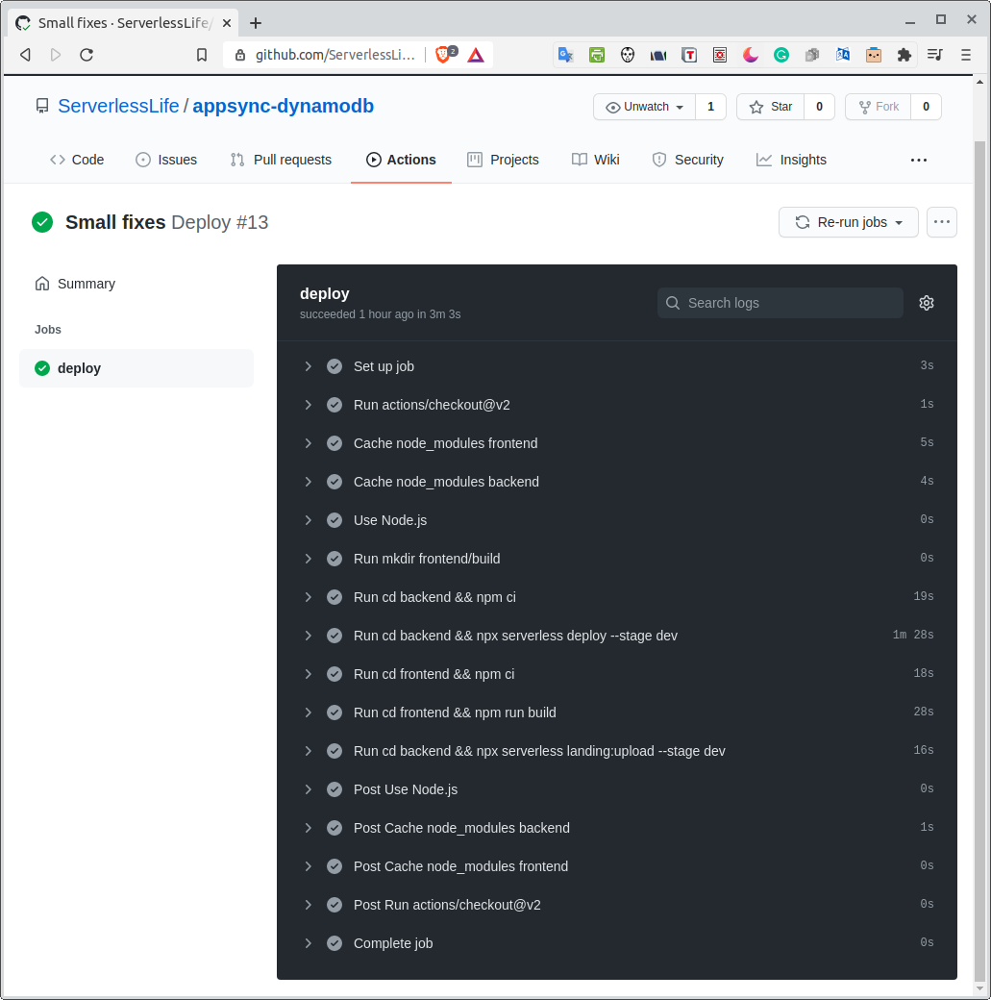

# Serverless "to-do" application with AWS AppSync, DynamoDB, and Lambda

Sample "to-do" application to demonstrate the integration of AWS AppSync with AWS DynamoDB via AWS Lambda without VTL. Code is written in TypeScript.

The goal was to build a fully functional application that is very simple with as little boilerplate code and as few libraries as possible.

The project is organized as a monorepo containing two main folders, one for the backend and another for the frontend.

App is available in folowing domain (if not already removed): 

**Dev:** 
https://todo-dev.markotest.com/ 

**Staging:** 
https://todo-staging.markotest.com/ 

**Production:** 
https://todo.markotest.com/ 

## Backend
Backend is build with [Serverless framework](https://www.serverless.com/). Severlal pulgins are used:
  - `serverless-iam-roles-per-function` - enables individual role per function to improve security
  - `serverless-webpack` - module bundler
  - `serverless-appsync-plugin` - support for AppSync
  - `aws-amplify-serverless-plugin` - exporting `schema.json` and `aws-exports.js`, that are used by Amplify on frontend
  - `serverless-lift` - deploying frontend as static web site using S3 and CouldFront

Authentication is done with Amazon Cognito. Usernam&password login is supported.

### Project structure
  - `backend/src/functions` - Lambda functions 
  - `backend/src/model` - Data model
  - `backend/src/util` - Helper functions
  - `backend/schema.graphql` - GraphQL schema

## Using
  - Run `npm run deploy` to deploy the solution

## Database: AWS DynamoDB
The single table design is used to structure data - [DynamoDB Design Patterns for Single Table Design](https://www.serverlesslife.com/DynamoDB_Design_Patterns_for_Single_Table_Design.html). The partition key is filled with user id, and the sort key with the "Todo" entity id. For id, KSUID is used. KSUID is similar to UUID, but it is sortable because the first part contains a timestamp. This solution allows us to retrieve all users' todos by partition key, sorted by date of entering.

## Frontend
The frontend is build using React, AWS Amplify, and MaterialUI. 

Amplify has two purposes:
 - Sign-up and login user.
 - Generating TypeScript types from GraphQl.

## Using
  - Run `npm run generate-gql-types` to generate TypeScript types from GraphQl. You must deploy the backend before because you need generated `schema.json`.
  - Run `npm run start` to run the app on localhost http://localhost:3000/. You must deploy the backend before because you need generated `aws-exports.js`.
  - Run `npm run build` to build the app. You must deploy the backend before because you need generated `aws-exports.js`.  

## CI/CD
CI/CD is created with GitHub actions.

Code: `.github/workflows/cicd.yml`

[Serverless Lift](https://www.npmjs.com/package/serverless-lift) plugin for [Serverless framework](https://www.serverless.com/) with its [Static website](https://github.com/getlift/lift/blob/master/docs/static-website.md) feature is used to deploy frontend.



### Custom domain
To have custom domain you should:
 * Enter desired domain in [serverless.yml](backend/serverless.yml) `constructs\landing\domain`
  and `certificate`.
 * Enter ARN of the certificate in [serverless.yml](backend/serverless.yml) `constructs\landing\certificate`.
 * After deployment you see:
```
landing:
  url: https://mywebsite.com
  cname: s13hocjp.cloudfront.net
```

You have to create a CNAME DNS entry in AWS Route55 that points to your `xxx.cloudfront.net` domain. After a few minutes/hours, the domain should be available.

